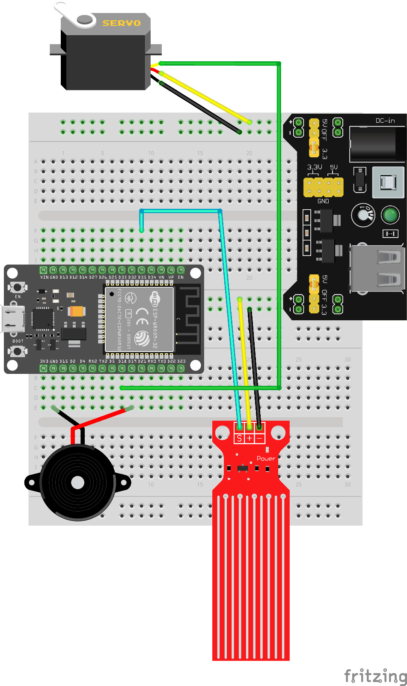

# POST TEST 3 - Smart Dam Water Gate Monitoring System

## 👥 ANGGOTA KELOMPOK
1. 2309106023 - Muhammad Guntur Adyatma
2. 2409106029 - Ridho Setiawan
3. 2409106038 - Triya Khairun Nisa

## 📖 Deskripsi
Proyek ini merupakan sistem pemantauan dan pengendalian pintu air bendungan pintar berbasis Internet of Things (IoT). Sistem ini mengintegrasikan sensor ketinggian air, motor servo untuk menggerakkan pintu air, dan buzzer sebagai alarm peringatan dini. Kontrol dapat dilakukan secara otomatis berdasarkan ketinggian air maupun manual melalui aplikasi Kodular.

**Fitur:**
- **a) Automatic water level control:** Pintu air terbuka otomatis sesuai level ketinggian air (Aman/Waspada/Bahaya)
- **b) Dual mode operation:** Mode otomatis dan manual yang dapat dipilih melalui aplikasi
- **c) Real-time monitoring:** Monitoring nilai sensor, status air, posisi servo, dan status buzzer secara real-time
- **d) Emergency alarm:** Buzzer berkedip otomatis saat kondisi bahaya atau mode manual aktif
- **e) MQTT communication:** Komunikasi data menggunakan protokol MQTT untuk respons yang cepat dan efisien

## ❕Pembagian Tugas
1. [2309106023 - Muhammad Guntur Adyatma] → Perancangan rangkaian (hardware) & wiring
2. [2409106029 - Ridho Setiawan] → Pemrograman ESP32 pada Arduino IDE & konfigurasi Kodular
3. [2409106038 - Triya Khairun Nisa] → Merapikan Tampilan Kodular & dokumentasi

## 🧰 Komponen yang Digunakan
1. ESP32 
2. Water Level Sensor
3. Motor Servo 
4. Active Buzzer
5. Breadboard
6. Kabel jumper
7. Power Module
8. Platform IoT: MQTT Broker (broker.emqx.io)
9. Aplikasi Mobile: Kodular

## 🔌 Board Schematic

| Komponen                  | Pin ESP32              | Kategori              | Keterangan                                      |
|---------------------------|------------------------|-----------------------|-------------------------------------------------|
| Water Level Sensor (S)    | `GPIO 35`              | Sensor Analog         | Membaca nilai ketinggian air (0–4095)           |
| Water Level Sensor (+)    | `3.3V`                 | Sensor Power          | Sumber daya sensor water level                  |
| Water Level Sensor (-)    | `GND`                  | Sensor Ground         | Ground sensor water level                       |
| Motor Servo (Signal)      | `GPIO 18`              | Aktuator              | Kontrol posisi pintu air (0°, 90°, 180°)        |
| Motor Servo (VCC)         | `5V/3.3V`              | Aktuator Power        | Sumber daya motor servo                         |
| Motor Servo (GND)         | `GND`                  | Aktuator Ground       | Ground motor servo                              |
| Buzzer (+)                | `GPIO 19`              | Alarm                 | Output alarm peringatan                         |
| Buzzer (-)                | `GND`                  | Alarm Ground          | Ground buzzer                                   |

### Logika Sistem

| Level Air      | Nilai Sensor | Status   | Posisi Servo | Buzzer      |
|----------------|--------------|----------|--------------|-------------|
| Aman           | ≤ 800        | Normal   | 0° (Tertutup)| OFF         |
| Waspada        | 801 - 1500   | Warning  | 90° (Setengah)| OFF        |
| Bahaya         | > 1500       | Danger   | 180° (Penuh) | ON (Blink)  |

### MQTT Topics

| Topic                      | Fungsi                        | Payload               |
|----------------------------|-------------------------------|-----------------------|
| `posttest3/iot/control`    | Kontrol mode manual/otomatis  | ON / OFF              |
| `posttest3/iot/nilai`      | Publish nilai sensor          | Integer (0-4095)      |
| `posttest3/iot/statusair`  | Publish status ketinggian air | Aman/Waspada/Bahaya   |
| `posttest3/iot/buzzer`     | Publish status buzzer         | ON / OFF              |
| `posttest3/iot/pintu`      | Publish posisi servo          | 0 / 90 / 180          |

### Rincian Gambar

## 🖥️ Video Demonstrasi
https://youtu.be/UhO3ILt_tQg?si=crf1-yGALMULOIcq

---

## 📱 Fitur Aplikasi Kodular

**Tampilan Utama:**
- Display nilai real-time sensor water level
- Indikator status air (Aman/Waspada/Bahaya) dengan color coding
- Status posisi pintu air (0°, 90°, 180°)
- Indikator status buzzer (ON/OFF)
- Toggle button untuk switch mode Otomatis/Manual

**Mode Operasi:**
- **Mode Otomatis:** Sistem bekerja sesuai threshold yang ditentukan
- **Mode Manual:** User dapat mengontrol aktuator secara remote melalui button di aplikasi

---

